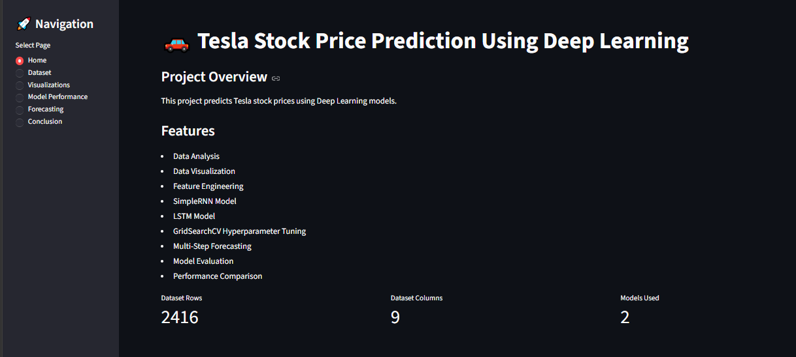
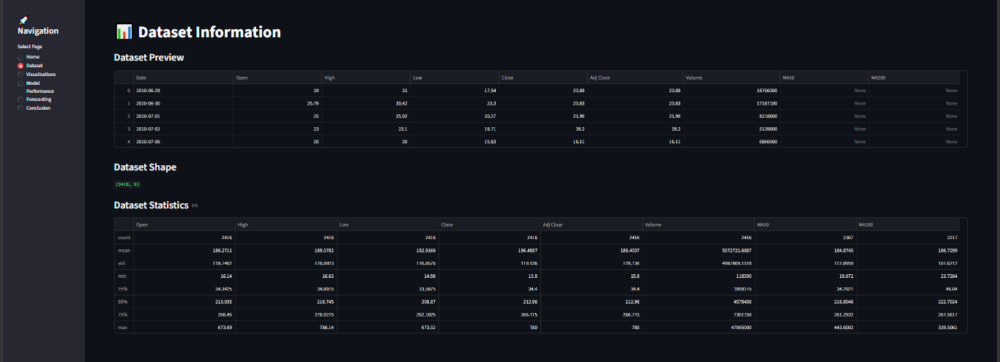
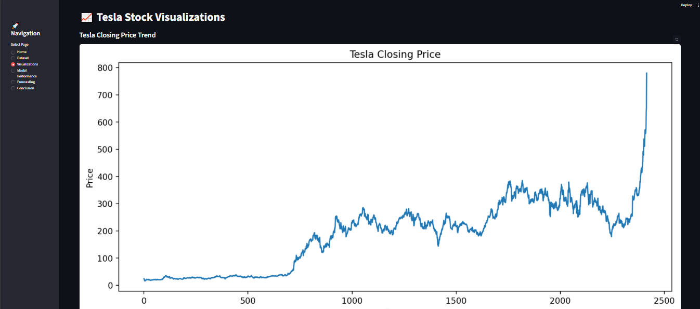
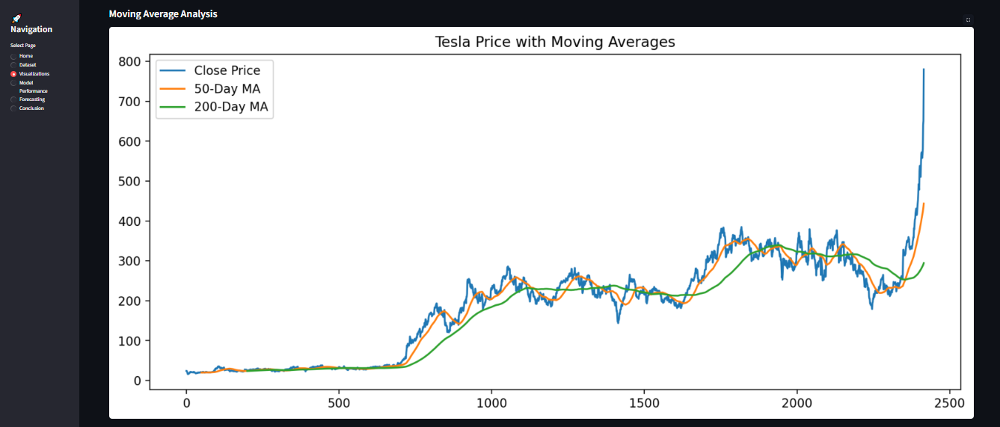
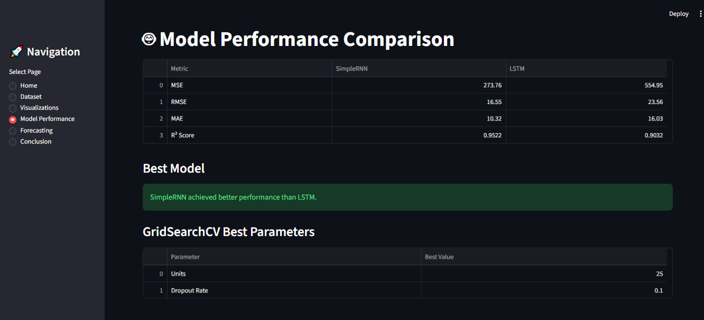
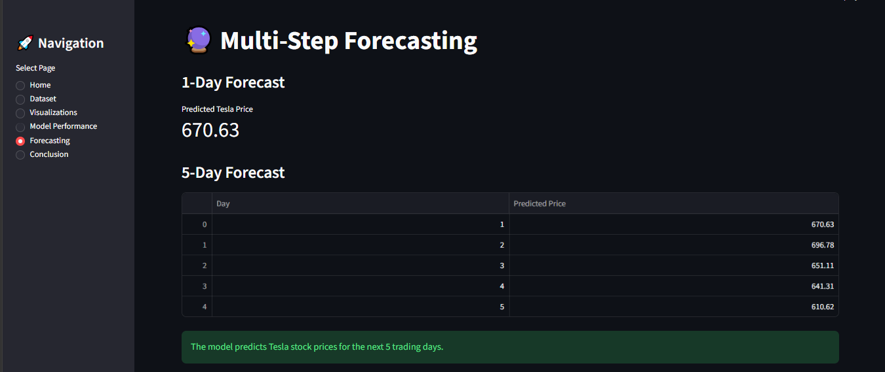
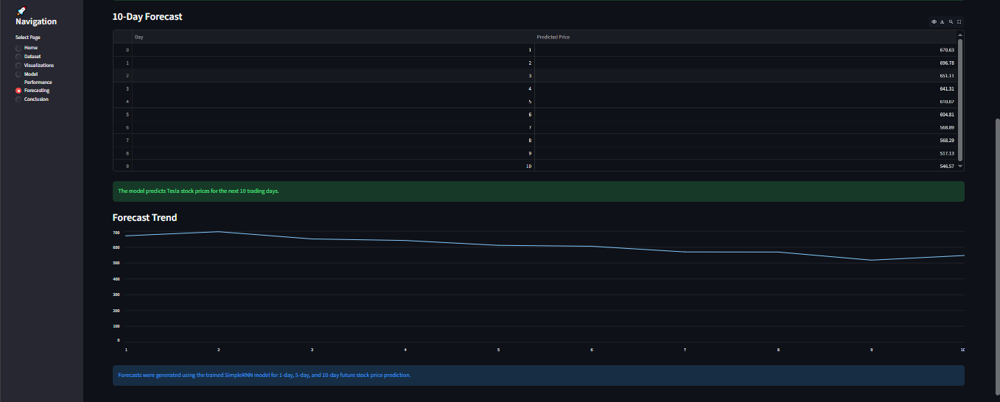
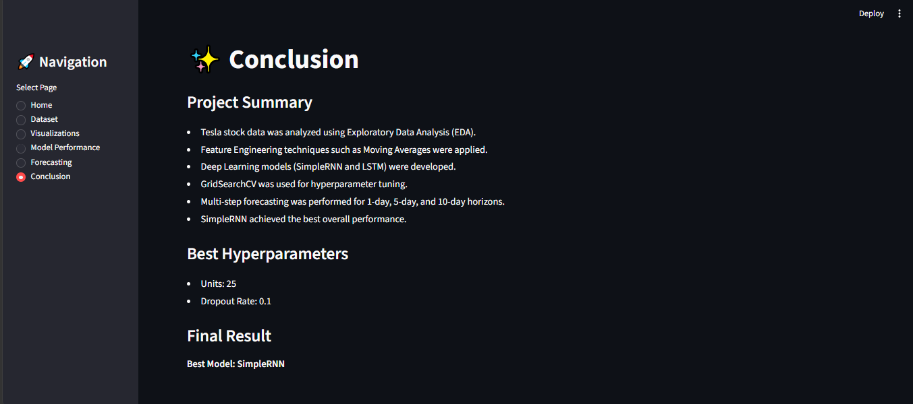

# Tesla Stock Price Forecasting Using SimpleRNN and LSTM Networks

## Overview

This project focuses on forecasting Tesla stock prices using Deep Learning techniques. Historical Tesla stock market data was analyzed, preprocessed, and used to train SimpleRNN and LSTM models for time-series forecasting.

The project includes Exploratory Data Analysis (EDA), Feature Engineering, Hyperparameter Tuning using GridSearchCV, Multi-Step Forecasting, and Streamlit Deployment.

---

## Project Objectives

* Analyze Tesla stock market data
* Perform Data Cleaning and Preprocessing
* Conduct Exploratory Data Analysis (EDA)
* Create Time-Series Sequences
* Build SimpleRNN Model
* Build LSTM Model
* Compare Model Performance
* Perform Hyperparameter Tuning using GridSearchCV
* Generate 1-Day, 5-Day, and 10-Day Forecasts
* Deploy the project using Streamlit

---

## Dataset Information

The Tesla stock dataset contains historical stock market information with the following features:

* Date
* Open
* High
* Low
* Close
* Adj Close
* Volume

The analysis and forecasting were performed using Tesla's Closing Price.

---

## Technologies Used

* Python
* Pandas
* NumPy
* Matplotlib
* Seaborn
* Scikit-Learn
* TensorFlow / Keras
* Streamlit

---

## Feature Engineering

The following features were created during analysis:

* 50-Day Moving Average (MA50)
* 200-Day Moving Average (MA200)
* Daily Returns

---

## Deep Learning Models

### SimpleRNN

Performance Metrics:

* MSE = 273.76
* RMSE = 16.55
* MAE = 10.32
* R² = 0.9522

### LSTM

Performance Metrics:

* MSE: 554.95
* RMSE: 23.56
* MAE: 16.03
* R² Score: 0.9032

---

## Best Model

Based on evaluation metrics, the SimpleRNN model achieved the best overall performance and was selected as the final forecasting model.

---

## Hyperparameter Tuning

### Best Parameters

* Units: 25
* Dropout Rate: 0.1

The GridSearchCV results indicated that an LSTM configuration with 25 units and a dropout rate of 0.1 achieved the best validation performance.

---

## Multi-Step Forecasting

### 1-Day Forecast

* Predicted Tesla Price: 670.63

### 5-Day Forecast

| Day | Predicted Price |
| --- | --------------- |
| 1   | 670.63          |
| 2   | 696.78          |
| 3   | 651.11          |
| 4   | 641.31          |
| 5   | 610.62          |

### 10-Day Forecast

The trained model successfully generated forecasts for the next 10 trading days and visualized future stock price trends.

---

## Streamlit Application

The Streamlit dashboard provides:

* Home Dashboard
* Dataset Information
* Data Visualizations
* Model Performance Comparison
* Multi-Step Forecasting
* Project Conclusion

Run the application:

```bash
cd streamlit
python -m streamlit run app.py
```
---

# Application Screenshots

## Home Dashboard



## Dataset Information



## Tesla Closing Price Trend



## Moving Average Analysis



## Model Performance Comparison



## 1-Day and 5-Day Forecast



## 10-Day Forecast



## Project Conclusion



---

## Project Structure

```text
Tesla_Stock_Prediction/
│
├── data/
│   └── TSLA.csv
│
├── models/
│   ├── best_rnn_model.keras
│   └── best_lstm_model.keras
│
├── notebooks/
│   └── Tesla_Stock_Prediction.ipynb
│
├── streamlit/
│   └── app.py
│
├── Screenshots/
│   ├── Home_Page.png
│   ├── Dataset_Information.png
│   ├── Closing_Price_Trend.png
│   ├── Moving_Average_Analysis.png
│   ├── Model_Performance.png
│   ├── Forecasting_1 & 5Day.png
│   ├── Forecasting_10Day.png
│   └── Project_Conclusion.png
│
├── report/
│   └── Tesla Stock Price Prediction Project Report.pdf
│
├── README.md
└── requirements.txt
```

---

## Conclusion

This project demonstrates the effectiveness of Deep Learning techniques for stock market forecasting. Both SimpleRNN and LSTM models successfully captured historical Tesla stock price patterns and generated meaningful future predictions.

Based on evaluation metrics, SimpleRNN achieved superior predictive performance and was selected as the final model. The project further incorporates GridSearchCV-based hyperparameter tuning, multi-step forecasting, and interactive Streamlit deployment, making it a complete end-to-end stock price forecasting solution.

---

## Future Scope

* Financial News Sentiment Analysis
* Macroeconomic Indicator Integration
* GRU-Based Forecasting
* Transformer-Based Forecasting
* ARIMA Comparison
* Automated Trading Strategies

---

## Author

**Vinay Pandey**

MCA | Full Stack Developer
